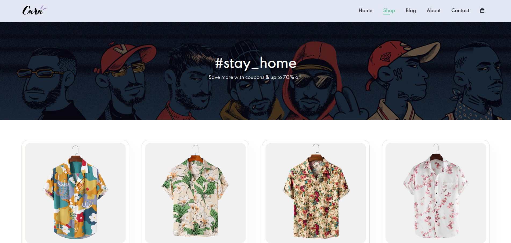

# E-commerce UI Project

This is my first project, aimed at building a simple user interface for an e-commerce platform. The main goal of this project was to help me get familiar with coding in JavaScript while utilizing HTML and CSS to design the front-end.

## Features

- **Responsive Design:** The UI is designed to be responsive across different devices.
- **Basic Interactivity:** Implemented JavaScript for basic functionalities like button clicks and dynamic content updates.
- **Simple Layout:** Focused on creating a clean and intuitive layout for the user interface.

## Technologies Used

- **HTML:** For structuring the webpage.
- **CSS:** For styling and layout.
- **JavaScript:** For adding interactivity and enhancing the user experience.

## What I Learned

- How to structure a web page using semantic HTML.
- Styling elements with CSS, including the use of Flexbox and Grid for layout.
- Writing basic JavaScript to handle events and update the DOM dynamically.
- Debugging and testing code to ensure functionality.

## Project Structure

```
Ecommerce-UI/
├── index.html     # Main HTML file
├── style.css      # CSS file for styling
└── script.js      # JavaScript file for interactivity
```

## Future Improvements

- Add more advanced JavaScript functionalities like a shopping cart or user authentication.
- Integrate with a backend service to manage products and user data.
- Enhance the design with animations and modern UI frameworks.

## How to Run

1. Clone the repository:
   ```bash
   git clone <repository-url>
   ```
2. Open the `index.html` file in any web browser.

## Acknowledgments

This project is a starting point for my journey in web development. Special thanks to online tutorials and community forums for guidance and resources.





